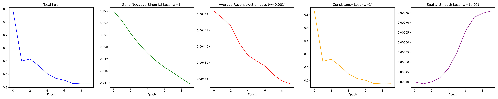
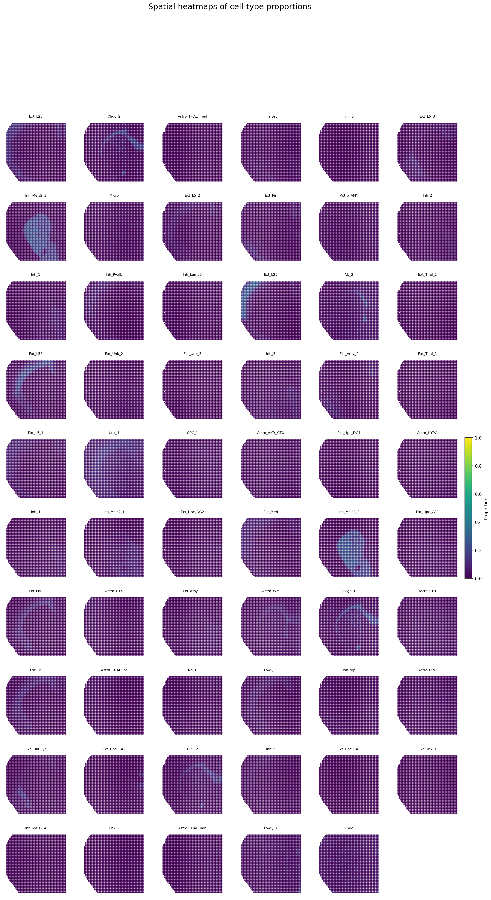

Results
=======

Mouse brain RNA + H3K27ac peak example
--------------------------------------

This page shows representative outputs generated from the mouse brain example used in the SMODER tutorial.

The example is referred to as the Mousebrain H3K27ac example because the main spatial multi-omics input consists of spatial RNA data and a paired H3K27ac peak matrix. For the gene-level denoising visualization, a gene-level epigenomic target matrix is used to generate interpretable spatial heatmaps.

Training loss
~~~~~~~~~~~~

   Training loss curve of the Mousebrain H3K27ac SMODER run.

Cell-type proportion heatmaps
~~~~~~~~~~~~~~~~~~~~~~~~~~~~

   Spatial heatmaps of inferred cell-type proportions for all cell types.

A compact view of selected high-abundance cell types is shown below.

.. figure:: _static/results/mousebrain_h3k27ac/mousebrain_cell_type_proportion_top12.png
   :width: 100%
   :align: center

   Spatial heatmaps of selected cell-type proportions.

Denoised RNA gene expression
~~~~~~~~~~~~~~~~~~~~~~~~~~~

The following panels show denoised spatial expression patterns for selected RNA genes.

.. list-table::
   :widths: 50 50

   * - .. image:: _static/results/mousebrain_h3k27ac/mousebrain_rna_Penk_denoised_heatmap.png
          :width: 100%

       Penk

     - .. image:: _static/results/mousebrain_h3k27ac/mousebrain_rna_Ppp1r1b_denoised_heatmap.png
          :width: 100%

       Ppp1r1b

   * - .. image:: _static/results/mousebrain_h3k27ac/mousebrain_rna_Sez6l_denoised_heatmap.png
          :width: 100%

       Sez6l

     - .. image:: _static/results/mousebrain_h3k27ac/mousebrain_rna_Gng2_denoised_heatmap.png
          :width: 100%

       Gng2

Denoised gene-level epigenomic signal
~~~~~~~~~~~~~~~~~~~~~~~~~~~~~~~~~~~~

The following panels show denoised spatial patterns for selected gene-level epigenomic signals.

.. list-table::
   :widths: 50 50

   * - .. image:: _static/results/mousebrain_h3k27ac/mousebrain_epigenomics_Penk_denoised_heatmap.png
          :width: 100%

       Penk

     - .. image:: _static/results/mousebrain_h3k27ac/mousebrain_epigenomics_Ppp1r1b_denoised_heatmap.png
          :width: 100%

       Ppp1r1b

   * - .. image:: _static/results/mousebrain_h3k27ac/mousebrain_epigenomics_Sez6l_denoised_heatmap.png
          :width: 100%

       Sez6l

     - .. image:: _static/results/mousebrain_h3k27ac/mousebrain_epigenomics_Gng2_denoised_heatmap.png
          :width: 100%

       Gng2

Spatial clustering based on learned embeddings
~~~~~~~~~~~~~~~~~~~~~~~~~~~~~~~~~~~~~~~~~~~~~

.. figure:: _static/results/mousebrain_h3k27ac/mousebrain_embedding_spatial_clustering.png
   :width: 70%
   :align: center

   Spatial clustering based on the learned SMODER embedding.
