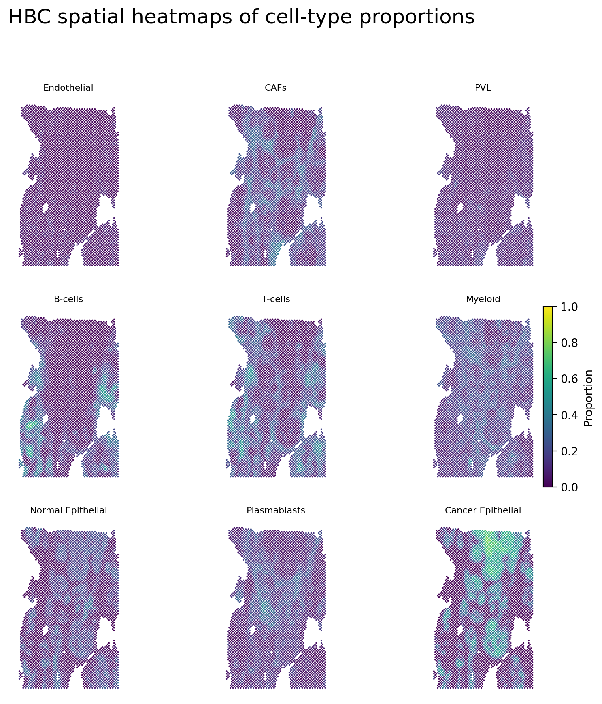
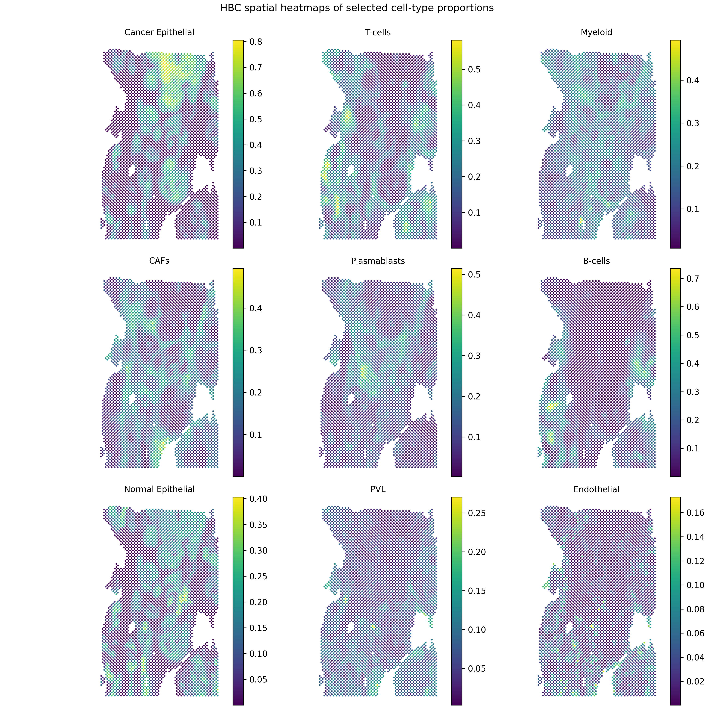
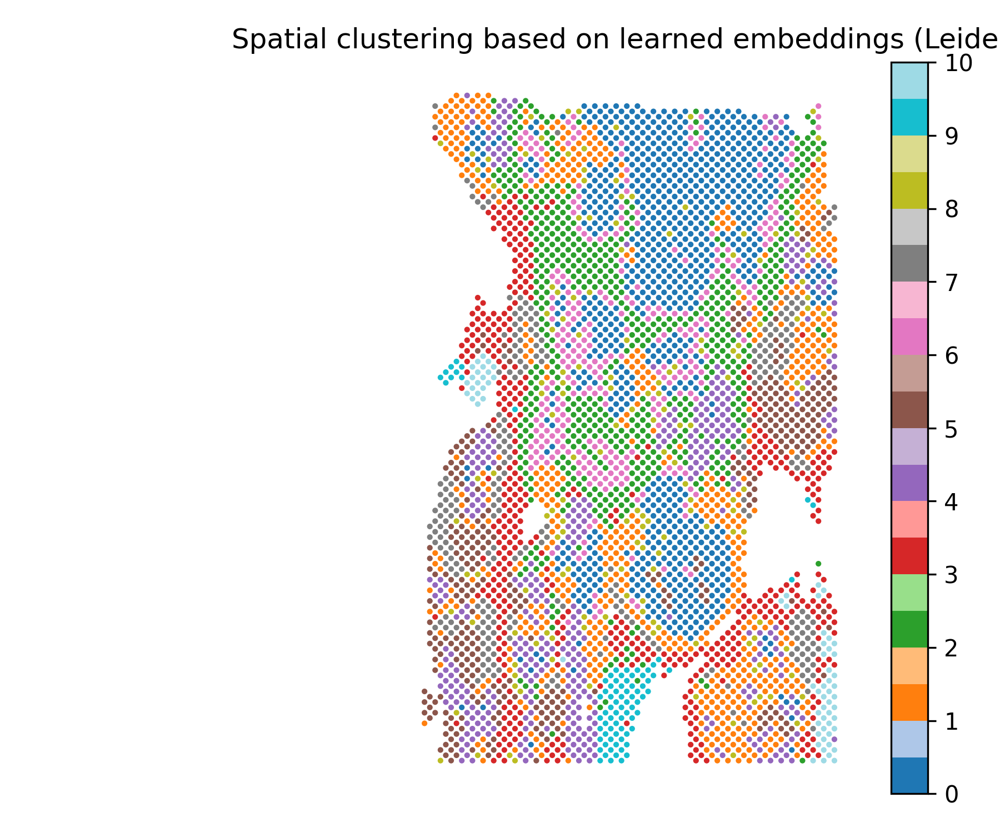

Results
=======

This page shows representative SMODER outputs from three datasets:

1. a simulated human melanoma dataset,
2. a mouse brain RNA + H3K27ac peak example,
3. a human breast cancer (HBC) RNA + ADT example.

The large intermediate AnnData result files are not included in the documentation repository. Instead, this page displays representative result figures generated from the SMODER output files.

Simulated human melanoma dataset
--------------------------------

For the simulated human melanoma dataset, we show spatial heatmaps of inferred cell-type proportions. A representative result from ``seed=1`` is used for visualization.

Cell-type proportion heatmaps
~~~~~~~~~~~~~~~~~~~~~~~~~~~~~

.. figure:: _static/results/simulated_human_melanoma/simulated_cell_type_proportion_all10.png
   :width: 100%
   :align: center

   Spatial heatmaps of inferred cell-type proportions in the simulated human melanoma dataset.

.. figure:: _static/results/simulated_human_melanoma/simulated_cell_type_proportion_top10.png
   :width: 100%
   :align: center

   A compact view of selected cell-type proportion heatmaps for the simulated human melanoma dataset.

Mouse brain RNA + H3K27ac peak example
--------------------------------------

This example is referred to as the Mousebrain H3K27ac example because the main spatial multi-omics input consists of spatial RNA data and a paired H3K27ac peak matrix. For gene-level denoising visualization, a gene-level epigenomic target matrix is used to generate interpretable spatial heatmaps.

Training loss
~~~~~~~~~~~~~

.. figure:: _static/results/mousebrain_h3k27ac/mousebrain_training_losses.png
   :width: 70%
   :align: center

   Training loss curve of the Mousebrain H3K27ac SMODER run.

Cell-type proportion heatmaps
~~~~~~~~~~~~~~~~~~~~~~~~~~~~~

.. figure:: _static/results/mousebrain_h3k27ac/mousebrain_cell_type_proportion_all59.png
   :width: 100%
   :align: center

   Spatial heatmaps of inferred cell-type proportions for all cell types.

.. figure:: _static/results/mousebrain_h3k27ac/mousebrain_cell_type_proportion_top12.png
   :width: 100%
   :align: center

   A compact view of selected high-abundance cell-type proportion heatmaps.

Denoised RNA gene expression
~~~~~~~~~~~~~~~~~~~~~~~~~~~~

.. list-table::
   :widths: 50 50

   * - .. figure:: _static/results/mousebrain_h3k27ac/mousebrain_rna_Penk_denoised_heatmap.png
          :width: 100%

          Penk

     - .. figure:: _static/results/mousebrain_h3k27ac/mousebrain_rna_Ppp1r1b_denoised_heatmap.png
          :width: 100%

          Ppp1r1b

   * - .. figure:: _static/results/mousebrain_h3k27ac/mousebrain_rna_Sez6l_denoised_heatmap.png
          :width: 100%

          Sez6l

     - .. figure:: _static/results/mousebrain_h3k27ac/mousebrain_rna_Gng2_denoised_heatmap.png
          :width: 100%

          Gng2

Denoised gene-level epigenomic signal
~~~~~~~~~~~~~~~~~~~~~~~~~~~~~~~~~~~~~

.. list-table::
   :widths: 50 50

   * - .. figure:: _static/results/mousebrain_h3k27ac/mousebrain_epigenomics_Penk_denoised_heatmap.png
          :width: 100%

          Penk

     - .. figure:: _static/results/mousebrain_h3k27ac/mousebrain_epigenomics_Ppp1r1b_denoised_heatmap.png
          :width: 100%

          Ppp1r1b

   * - .. figure:: _static/results/mousebrain_h3k27ac/mousebrain_epigenomics_Sez6l_denoised_heatmap.png
          :width: 100%

          Sez6l

     - .. figure:: _static/results/mousebrain_h3k27ac/mousebrain_epigenomics_Gng2_denoised_heatmap.png
          :width: 100%

          Gng2

Spatial clustering based on learned embeddings
~~~~~~~~~~~~~~~~~~~~~~~~~~~~~~~~~~~~~~~~~~~~~~

.. figure:: _static/results/mousebrain_h3k27ac/mousebrain_embedding_spatial_clustering.png
   :width: 70%
   :align: center

   Spatial clustering based on the learned SMODER embedding.

Human breast cancer RNA + ADT example
-------------------------------------

The HBC example integrates spatial RNA data with ADT/protein marker measurements. The result visualizations include inferred cell-type proportions, denoised RNA gene expression, denoised ADT marker signal, and spatial clustering based on the learned embedding.

Cell-type proportion heatmaps
~~~~~~~~~~~~~~~~~~~~~~~~~~~~~

   Spatial heatmaps of inferred cell-type proportions in the HBC dataset.

   A compact view of selected cell-type proportion heatmaps for the HBC dataset.

Denoised RNA gene expression
~~~~~~~~~~~~~~~~~~~~~~~~~~~~

.. list-table::
   :widths: 50 50

   * - .. figure:: _static/results/hbc/hbc_rna_EPCAM_denoised_heatmap.png
          :width: 100%

          EPCAM

     - .. figure:: _static/results/hbc/hbc_rna_KRT8_denoised_heatmap.png
          :width: 100%

          KRT8

   * - .. figure:: _static/results/hbc/hbc_rna_COL1A1_denoised_heatmap.png
          :width: 100%

          COL1A1

     - .. figure:: _static/results/hbc/hbc_rna_PECAM1_denoised_heatmap.png
          :width: 100%

          PECAM1

Denoised ADT marker signal
~~~~~~~~~~~~~~~~~~~~~~~~~~

.. list-table::
   :widths: 50 50

   * - .. figure:: _static/results/hbc/hbc_adt_KRT5.1_denoised_heatmap.png
          :width: 100%

          KRT5.1

     - .. figure:: _static/results/hbc/hbc_adt_CD68.1_denoised_heatmap.png
          :width: 100%

          CD68.1

   * - .. figure:: _static/results/hbc/hbc_adt_CD8A.1_denoised_heatmap.png
          :width: 100%

          CD8A.1

     - .. figure:: _static/results/hbc/hbc_adt_HLA-DRA_denoised_heatmap.png
          :width: 100%

          HLA-DRA

Spatial clustering based on learned embeddings
~~~~~~~~~~~~~~~~~~~~~~~~~~~~~~~~~~~~~~~~~~~~~~

   Spatial clustering of the HBC dataset based on the learned SMODER embedding.
