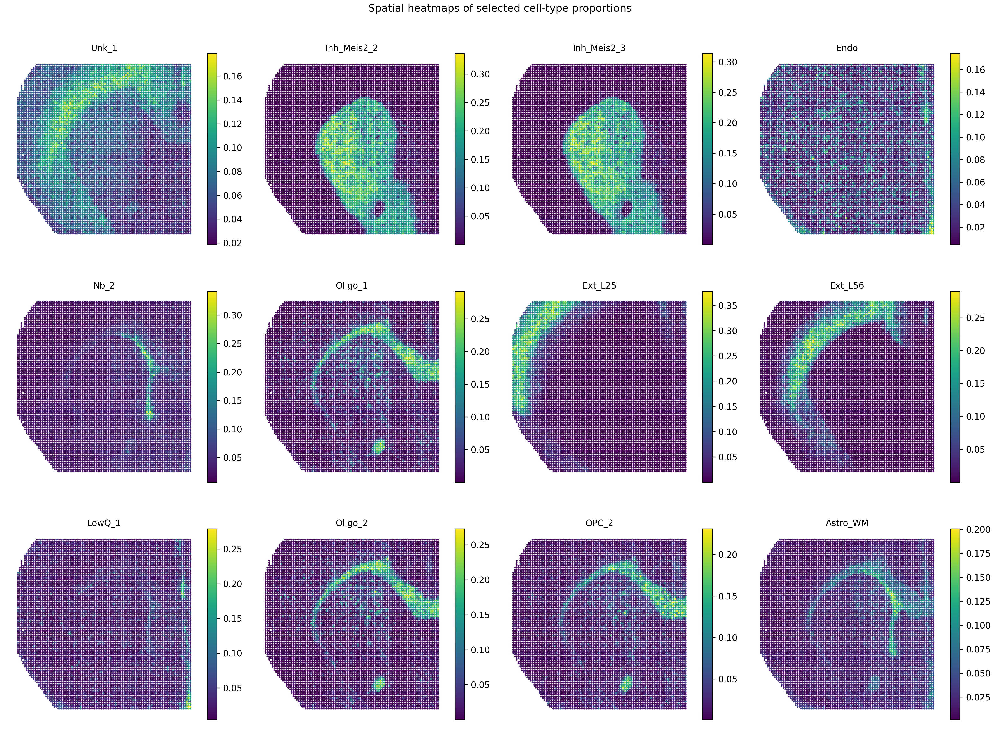
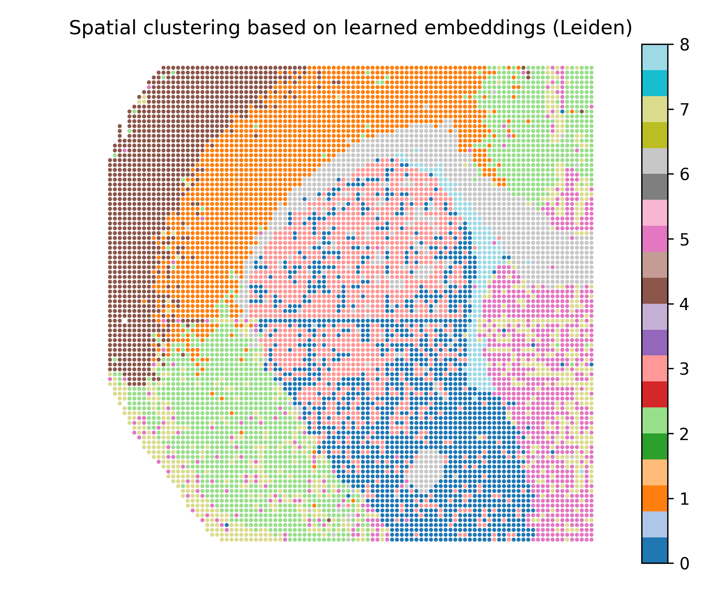

SMODER Tutorial 02: Mouse Brain H3K27ac Result Visualization
============================================================

This tutorial shows how to visualize representative SMODER outputs for the mouse brain RNA + H3K27ac peak example.

This tutorial continues from :doc:`01_mousebrain_h3k27ac_quickstart`. In Tutorial 01, SMODER is run on the Mousebrain H3K27ac dataset and generates the main result file:

.. code-block:: text

   spatial_decon_result.h5ad

Here, we use this SMODER output file to generate downstream result visualizations.

What is ``spatial_decon_result.h5ad``?
--------------------------------------

In SMODER, each dataset produces its own result file, conventionally named:

.. code-block:: text

   spatial_decon_result.h5ad

The same filename may appear in different output folders, but each file corresponds to a different dataset or run.

For the Mousebrain H3K27ac example, the file should contain:

.. code-block:: python

   adata.obsm["spatial"]
   adata.obsm["cell_type_proportions"]
   adata.obsm["embedding"]
   adata.obsm["rna_encoder"]
   adata.obsm["peak_encoder"]

These fields are used for spatial visualization, embedding-based clustering, and denoised signal reconstruction.

Load the SMODER result
----------------------

.. code-block:: python

   from pathlib import Path
   import scanpy as sc

   spatial_result = Path("path/to/mousebrain_H3K27ac/spatial_decon_result.h5ad")
   adata = sc.read_h5ad(spatial_result)

   print(adata)
   print(adata.obsm.keys())

Plot cell-type proportion heatmaps
----------------------------------

The inferred cell-type proportions are stored in:

.. code-block:: python

   adata.obsm["cell_type_proportions"]

The cell-type names are usually stored in ``adata.obs`` after metadata columns.

For the Mousebrain H3K27ac example, the first 9 columns of ``adata.obs`` are metadata, and cell-type names start from:

.. code-block:: python

   adata.obs.columns[9:]

A compact panel of cell-type proportion heatmaps can be generated by:

.. code-block:: python

   from smoder.visualization import plot_cell_type_proportion_panel

   plot_cell_type_proportion_panel(
       adata,
       out_path="mousebrain_cell_type_proportion_top12.png",
       obsm_key="cell_type_proportions",
       obs_start_col=9,
       top_n=12,
       ncols=4,
       title="Spatial heatmaps of selected cell-type proportions",
   )

Plot spatial clusters from learned embeddings
---------------------------------------------

The learned SMODER embedding is stored in:

.. code-block:: python

   adata.obsm["embedding"]

We can cluster this embedding and visualize the cluster labels spatially:

.. code-block:: python

   from smoder.visualization import plot_embedding_spatial_clustering

   clustered = plot_embedding_spatial_clustering(
       adata,
       out_path="mousebrain_embedding_spatial_clustering.png",
       embedding_key="embedding",
       method="leiden",
       resolution=0.6,
       n_neighbors=15,
   )

The resulting cluster labels are stored in:

.. code-block:: python

   clustered.obs["smoder_cluster"]

Reconstruct denoised RNA marker expression
------------------------------------------

SMODER stores RNA encoder representations in:

.. code-block:: python

   adata.obsm["rna_encoder"]

The function ``omics_reconstruct`` can reconstruct selected RNA marker genes from the trained SMODER representation.

.. code-block:: python

   from smoder.postprocessing import omics_reconstruct

   rna_recon = omics_reconstruct(
       omics_type="RNA",
       expr_path="path/to/RNA.h5ad",
       spatial_path="path/to/mousebrain_H3K27ac/spatial_decon_result.h5ad",
       target_genes=["Penk", "Ppp1r1b", "Sez6l", "Gng2"],
       encoder_key="rna_encoder",
       hidden_dim=256,
       n_layers=3,
       epochs=500,
       lr=1e-4,
       patience=100,
       save_path="RNA_recon.h5ad",
   )

The reconstructed values are stored in ``rna_recon.X``.

Then plot spatial heatmaps of the reconstructed RNA markers:

.. code-block:: python

   from smoder.visualization import plot_reconstruction_heatmaps

   plot_reconstruction_heatmaps(
       rna_recon,
       out_dir="figures",
       prefix="mousebrain_rna",
       title_prefix="Denoised RNA expression",
   )

Reconstruct denoised gene-level epigenomic signals
--------------------------------------------------

The second modality in this example is H3K27ac peak data. For gene-level denoised visualization, use a gene-level epigenomic target matrix and the SMODER peak encoder representation:

.. code-block:: python

   adata.obsm["peak_encoder"]

Run reconstruction with ``omics_type="EPIGENOMICS"``:

.. code-block:: python

   epi_recon = omics_reconstruct(
       omics_type="EPIGENOMICS",
       expr_path="path/to/gene_level_epigenomic_signal.h5ad",
       spatial_path="path/to/mousebrain_H3K27ac/spatial_decon_result.h5ad",
       target_genes=["Penk", "Ppp1r1b", "Sez6l", "Gng2"],
       encoder_key="peak_encoder",
       hidden_dim=256,
       n_layers=3,
       epochs=500,
       lr=1e-4,
       patience=100,
       spatial_k=12,
       do_preprocess=True,
       save_path="epigenomics_recon.h5ad",
   )

Then plot heatmaps of reconstructed gene-level epigenomic signals:

.. code-block:: python

   plot_reconstruction_heatmaps(
       epi_recon,
       out_dir="figures",
       prefix="mousebrain_epigenomics",
       title_prefix="Denoised gene-level epigenomic signal",
   )

Complete plotting script
------------------------

The repository also provides a plotting script that follows the same logic:

.. code-block:: text

   scripts/plot_mousebrain_h3k27ac_results_for_docs.py

In practice, you can adapt the path variables at the top of this script to your own local data locations.

Representative results
----------------------

Cell-type proportion heatmaps
^^^^^^^^^^^^^^^^^^^^^^^^^^^^^

Spatial clustering from learned embeddings
^^^^^^^^^^^^^^^^^^^^^^^^^^^^^^^^^^^^^^^^^^

Denoised RNA marker heatmaps
^^^^^^^^^^^^^^^^^^^^^^^^^^^^

.. list-table::
   :widths: 50 50

   * - .. image:: ../_static/results/mousebrain_h3k27ac/mousebrain_rna_Gng2_denoised_heatmap.png
          :width: 100%

       Gng2

     - .. image:: ../_static/results/mousebrain_h3k27ac/mousebrain_rna_Penk_denoised_heatmap.png
          :width: 100%

       Penk

   * - .. image:: ../_static/results/mousebrain_h3k27ac/mousebrain_rna_Ppp1r1b_denoised_heatmap.png
          :width: 100%

       Ppp1r1b

     - .. image:: ../_static/results/mousebrain_h3k27ac/mousebrain_rna_Sez6l_denoised_heatmap.png
          :width: 100%

       Sez6l

Denoised gene-level epigenomic signal heatmaps
^^^^^^^^^^^^^^^^^^^^^^^^^^^^^^^^^^^^^^^^^^^^^^

.. list-table::
   :widths: 50 50

   * - .. image:: ../_static/results/mousebrain_h3k27ac/mousebrain_epigenomics_Gng2_denoised_heatmap.png
          :width: 100%

       Gng2

     - .. image:: ../_static/results/mousebrain_h3k27ac/mousebrain_epigenomics_Penk_denoised_heatmap.png
          :width: 100%

       Penk

   * - .. image:: ../_static/results/mousebrain_h3k27ac/mousebrain_epigenomics_Ppp1r1b_denoised_heatmap.png
          :width: 100%

       Ppp1r1b

     - .. image:: ../_static/results/mousebrain_h3k27ac/mousebrain_epigenomics_Sez6l_denoised_heatmap.png
          :width: 100%

       Sez6l
