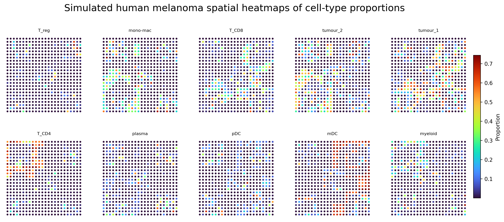
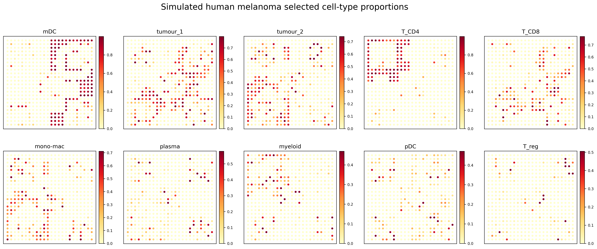

SMODER Tutorial 03: Simulated Human Melanoma Result Visualization
=================================================================

This tutorial shows how to visualize inferred cell-type proportions for a simulated human melanoma dataset.

This tutorial starts from a precomputed dataset-specific SMODER output file:

.. code-block:: text

   spatial_decon_result.h5ad

The upstream SMODER run follows the same general idea as Tutorial 01: run SMODER on a dataset to produce a result file, then use the result file for downstream visualization. Here, we focus on the visualization step.

What is ``spatial_decon_result.h5ad``?
--------------------------------------

In SMODER, each dataset produces its own result file, conventionally named:

.. code-block:: text

   spatial_decon_result.h5ad

The simulated human melanoma result file is different from the Mousebrain and HBC result files, even though the filename is the same.

For this dataset, the result file should contain:

.. code-block:: python

   adata.obsm["spatial"]
   adata.obsm["cell_type_proportions"]

Load the SMODER result
----------------------

.. code-block:: python

   from pathlib import Path
   import scanpy as sc

   spatial_result = Path("path/to/simulated_human_melanoma/spatial_decon_result.h5ad")
   adata = sc.read_h5ad(spatial_result)

   print(adata)
   print(adata.obs.columns)
   print(adata.obsm.keys())

Extract spatial coordinates and proportions
-------------------------------------------

The spatial coordinates are stored in:

.. code-block:: python

   adata.obsm["spatial"]

The inferred cell-type proportions are stored in:

.. code-block:: python

   adata.obsm["cell_type_proportions"]

In this simulated dataset, the first four columns of ``adata.obs`` are metadata:

.. code-block:: text

   cell_count
   region_id
   dominant_cell_type
   second_sampling

The remaining columns correspond to simulated cell-type names.

.. code-block:: python

   import numpy as np

   coords = np.asarray(adata.obsm["spatial"])
   x = coords[:, 0]
   y = coords[:, 1]

   proportion_matrix = np.asarray(adata.obsm["cell_type_proportions"])
   cell_type_names = list(adata.obs.columns[4:])

Plot proportion heatmaps
------------------------

For proportion heatmaps, a sequential colormap is useful because the values have a natural low-to-high ordering.

.. code-block:: python

   import matplotlib.pyplot as plt
   import numpy as np

   cmap = "YlOrRd"

   for i, cell_type in enumerate(cell_type_names):
       values = proportion_matrix[:, i]

       vmax = np.quantile(values, 0.98)
       if vmax <= 0:
           vmax = values.max()
       if vmax <= 0:
           vmax = 1.0

       fig, ax = plt.subplots(figsize=(5, 5))
       sca = ax.scatter(
           x,
           y,
           c=values,
           cmap=cmap,
           vmin=0,
           vmax=vmax,
           s=18,
           edgecolors="none",
       )

       ax.set_title(cell_type)
       ax.set_aspect("equal")
       ax.set_xticks([])
       ax.set_yticks([])
       ax.invert_yaxis()

       fig.colorbar(sca, ax=ax, fraction=0.046, pad=0.04)
       fig.savefig(f"{cell_type}.png", dpi=300, bbox_inches="tight")
       plt.close(fig)

The same idea can be extended to a multi-panel figure by plotting each cell type in one subplot.

Complete plotting script
------------------------

The repository provides a plotting script that implements this workflow:

.. code-block:: text

   scripts/plot_simulated_human_melanoma_results_for_docs.py

You can adapt the input path at the top of this script to your own SMODER result file.

Representative results
----------------------

All cell-type proportion heatmaps
^^^^^^^^^^^^^^^^^^^^^^^^^^^^^^^^^

Compact proportion panel
^^^^^^^^^^^^^^^^^^^^^^^^

Notes
-----

The simulated dataset contains relatively sparse local hotspots for some cell types. Therefore, the plotting workflow uses a warm sequential colormap and a quantile-based upper color limit to make high-proportion regions more visually distinguishable.
